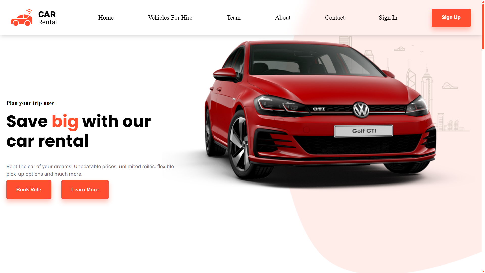

# Car Rental Website

Welcome to the Car Rental Website project! This project is designed to provide a modern and engaging online presence for the car rentak company, featuring components such as About, Contact Information, and more. Built with React, this application delivers a seamless user experience with modern design aesthetics.

## 📸 Screenshots



## 🚀 Installation

Follow these steps to set up and run the project on your local machine.

### 1. Clone the Repository

Clone the repository to your local machine using Git:

```bash
git clone https://github.com/NqabaXO/ACA.git
cd your-repository
```

### 2. Install Dependencies

Ensure you have [Node.js](https://nodejs.org/) installed. Then, install the project dependencies using:

```bash
npm install
```

or

```bash
yarn install
```


### 3. Run the Development Server

Start the development server using:

```bash
npm run dev
```

or

```bash
yarn dev
```

Your application will be available at `http://localhost:3000`.

## 📦 Usage

Navigate through the following sections of the website:

- **Home Page**: Features an introduction to the car rental dashbord with a modern layout.
- **Vehicles For Hire**: Provides information about the vehicles that are available for hire.
- **Team**: Feature the technical team that runs the company, their names as well as their position.
- **About**: Provides information about the history of the company.
- **Contact**: Includes a contact form, office hours, location map, and details about the mobile application.

### Contact Form

The contact form uses [EmailJS](https://www.emailjs.com/) for sending emails. Ensure you configure your email service correctly in the `.env` file.


## 📝 Acknowledgements

I would like to thank my family, friends and give honor to God for helping me and carrying me throughout this journey

- **React**: A JavaScript library for building user interfaces.
- **Tailwind CSS**: A utility-first CSS framework for designing beautiful interfaces.


